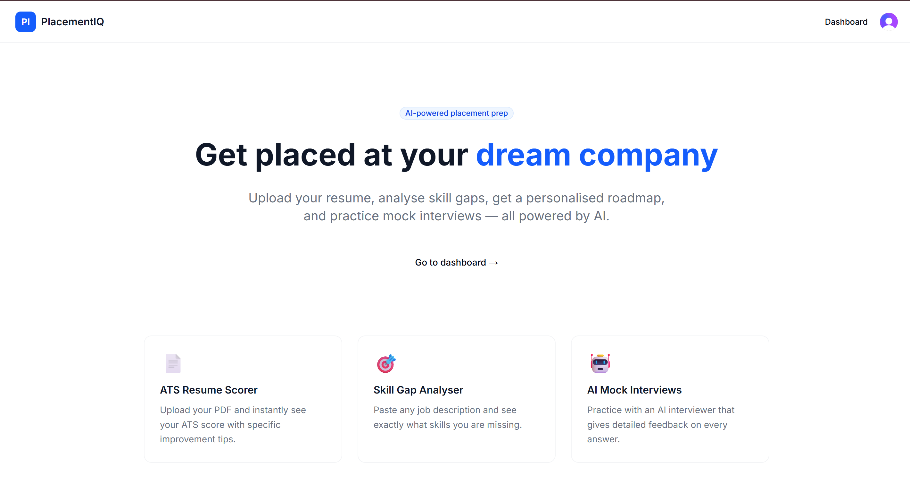
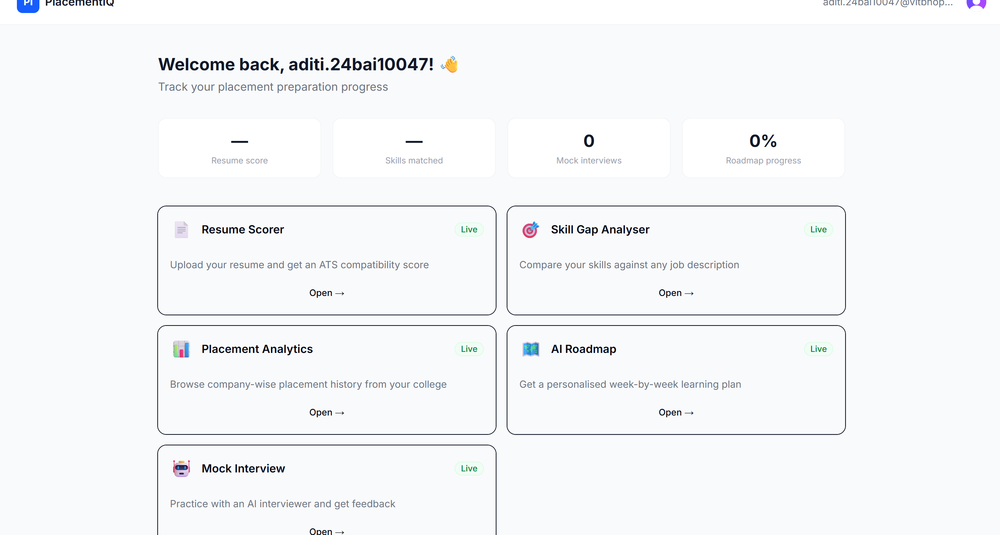
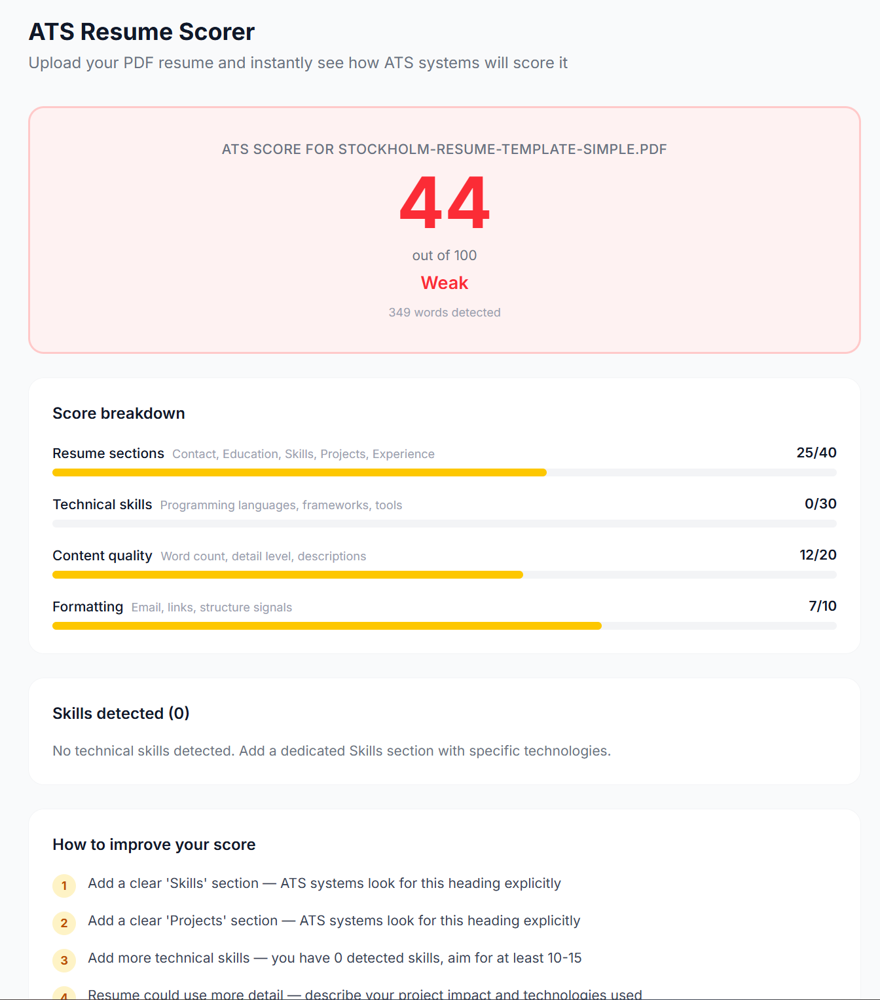
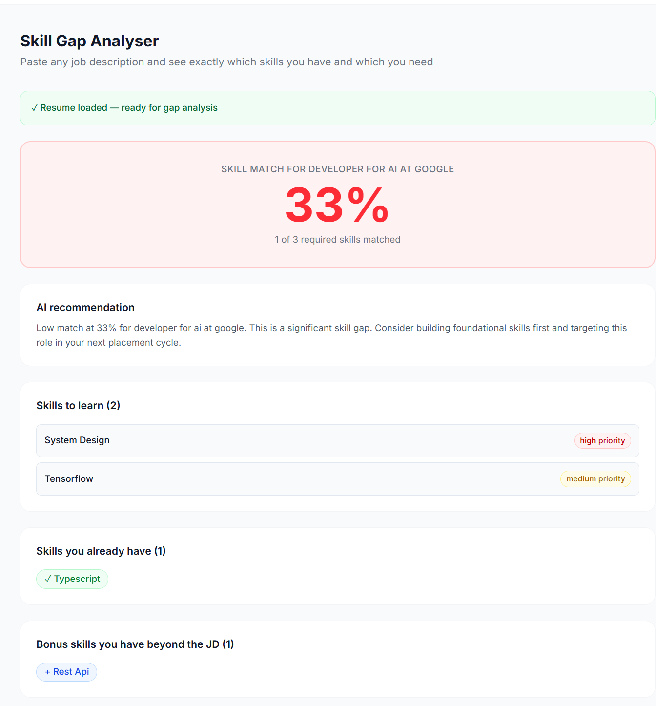
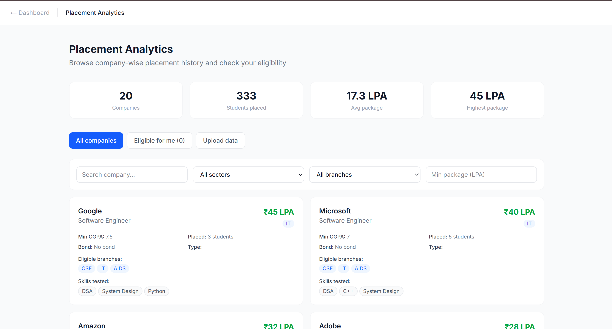
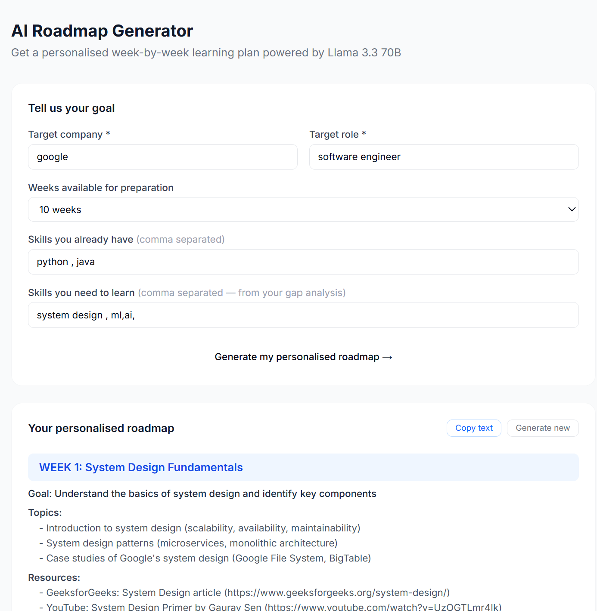
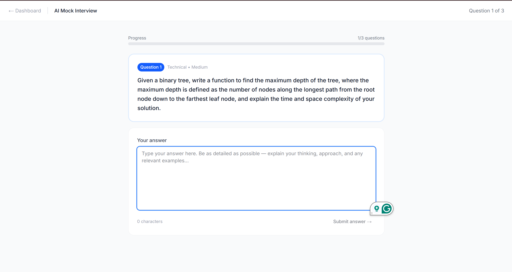

# PlacementIQ — AI-Powered Student Placement Platform

> Helping engineering students get placed at their dream companies using AI

[](https://placement-intelligence-platform-murex.vercel.app)
[](https://placement-iq-api.onrender.com/docs)
[](https://github.com/AditiSi07/placement-intelligence-platform)
[](LICENSE)

---

## Live Demo

**App:** https://placement-intelligence-platform-murex.vercel.app  
**API Docs:** https://placement-iq-api.onrender.com/docs

> Note: Backend on Render free tier may take 30 seconds to wake up on first request.

---

## The Problem

Every year, thousands of engineering students apply for campus placements with:
- Resumes full of formatting errors that ATS systems reject instantly
- No idea which skills they are missing for their target companies
- Zero structured interview practice
- Placement cells running on Excel sheets and WhatsApp groups

**PlacementIQ solves all of this in one AI-powered platform.**

---

## Features

| Feature | Description | Tech used |
|---|---|---|
| ATS Resume Scorer | Upload PDF → instant ATS score + improvement tips | pdfplumber, Python NLP |
| Skill Gap Analyser | Paste any JD → see exactly what skills you are missing | Custom skill taxonomy |
| Placement Analytics | Company-wise history, packages, eligibility filter | PostgreSQL, CSV import |
| AI Roadmap Generator | Personalised week-by-week learning plan | Groq Llama 3.3 70B |
| AI Mock Interviews | Practice interviews + per-answer evaluation + final report | Groq Llama 3.3 70B |

---

## Screenshots

### Landing Page


### Dashboard


### ATS Resume Scorer


### Skill Gap Analyser


### Placement Analytics


### AI Roadmap Generator


### AI Mock Interview


---

## Tech Stack

### Frontend
- **Next.js 16** with TypeScript and App Router
- **Tailwind CSS** + shadcn/ui for components
- **Clerk** for authentication
- Deployed on **Vercel**

### Backend
- **FastAPI** (Python 3.12) with SQLAlchemy ORM
- **pdfplumber** for PDF text extraction
- **Groq API** (Llama 3.3 70B) for AI features
- Deployed on **Render**

### Database & Storage
- **Supabase PostgreSQL** — 7 tables, production-ready schema
- Row-level security policies

### AI & ML
- **Groq Llama 3.3 70B** — roadmap generation and mock interviews
- Custom **skill taxonomy** with 40+ skills and aliases
- **NLP-based ATS scoring** — sections, keywords, formatting

---

## System Architecture
┌─────────────────────────────────────┐

│     Next.js Frontend (Vercel)        │

│  Landing │ Dashboard │ 5 Features   │

└──────────────┬──────────────────────┘

│ HTTPS API calls

▼

┌─────────────────────────────────────┐

│      FastAPI Backend (Render)        │

│  7 route modules │ 20+ endpoints    │

└───┬──────────────┬──────────────────┘

│              │

▼              ▼

┌────────┐   ┌──────────┐   ┌────────┐

│Supabase│   │Groq API  │   │ Clerk  │

│Postgres│   │Llama 3.3 │   │  Auth  │

└────────┘   └──────────┘   └────────┘

---

## Database Schema

7 production tables:
users              → student and coordinator profiles

resumes            → uploaded PDFs + ATS scores + parsed text

jobs               → job descriptions for gap analysis

skills             → master skill taxonomy (40+ skills seeded)

gap_analyses       → resume vs JD comparison results

mock_interviews    → AI interview sessions + full transcripts

placement_history  → company-wise college placement data

roadmaps           → AI-generated personalised learning plans

---

## Local Setup

### Prerequisites
- Node.js 18+, Python 3.12, Git

### 1. Clone
```bash
git clone https://github.com/AditiSi07/placement-intelligence-platform.git
cd placement-intelligence-platform
```

### 2. Backend
```bash
cd backend
py -3.12 -m venv venv
venv\Scripts\activate
pip install -r requirements.txt
cp .env.example .env
# Fill in your values
uvicorn main:app --reload --port 8000
```

### 3. Frontend
```bash
cd frontend
npm install
cp .env.example .env.local
# Fill in your values
npm run dev
```

### 4. Database
Run `docs/database-schema.sql` in your Supabase SQL Editor.

---

## API Endpoints

| Method | Endpoint | Description |
|---|---|---|
| GET | `/health` | Health check + DB status |
| POST | `/api/resume/upload` | Upload PDF + get ATS score |
| GET | `/api/resume/latest/:id` | Get latest resume analysis |
| POST | `/api/gap-analysis/analyse` | Run skill gap analysis |
| GET | `/api/placement/companies` | Browse companies with filters |
| POST | `/api/placement/upload-csv` | Import placement data |
| GET | `/api/placement/eligible/:id` | Get eligible companies |
| POST | `/api/roadmap/generate` | Generate AI roadmap |
| POST | `/api/interview/start` | Start mock interview |
| POST | `/api/interview/answer` | Submit answer + get evaluation |
| POST | `/api/interview/end` | End session + get final report |

Full docs: https://placement-iq-api.onrender.com/docs

---

## Development Timeline

Built in 10 weeks following a structured plan:

- Week 1 — Project setup, database schema, architecture design
- Week 2 — Authentication with Clerk (sign up, onboarding, protected routes)
- Week 3 — Resume upload, PDF parsing, ATS scoring engine
- Week 4 — Skill gap analyser with 40+ skill taxonomy
- Week 5 — Placement analytics dashboard with CSV import
- Week 6 — AI roadmap generator using Groq Llama 3.3 70B
- Week 7 — AI mock interview with per-answer evaluation
- Week 8 — Testing, mobile responsiveness, error boundaries
- Week 9 — Production deployment to Vercel + Render
- Week 10 — Documentation, launch, portfolio packaging

---

## Developer

Aditi Singh
3rd Year B.Tech —  VIT Bhopal  


[LinkedIn](www.linkedin.com/in/aditisingh07102007) | [GitHub](https://github.com/AditiSi07) | [Live App](https://placement-intelligence-platform-murex.vercel.app)

---

## License

MIT License — see [LICENSE](LICENSE) for details.


